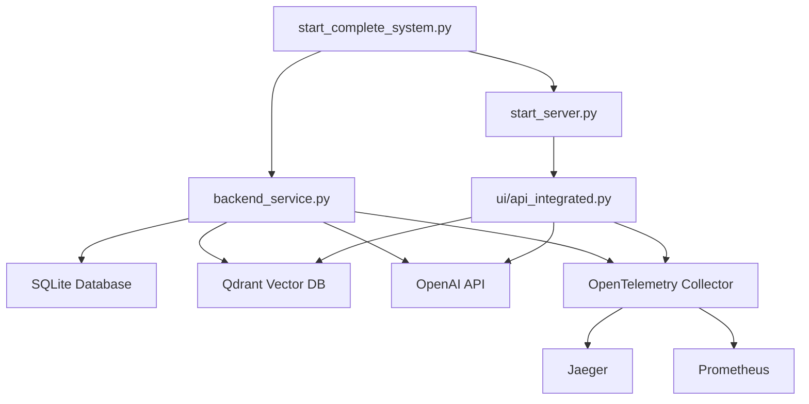

# OpenTelemetry Instrumentation for Document RAG System

This document provides comprehensive instructions for setting up and using OpenTelemetry instrumentation in the Document RAG production system.

## 🎯 Overview

The Document RAG system has been fully instrumented with OpenTelemetry to provide:

- **Distributed Tracing**: End-to-end request tracing across all services
- **Metrics Collection**: Performance metrics, counters, and gauges
- **Structured Logging**: Logs with trace correlation
- **Service Correlation**: Unified trace and span IDs across all components

## 📋 Prerequisites

1. **Python Dependencies**: All required OpenTelemetry packages are included in `requirements.txt`
2. **Environment Configuration**: OpenTelemetry settings in `.env` file
3. **Observability Backend**: Jaeger, Prometheus, or other OTLP-compatible systems

## 🚀 Quick Start

### 1. Install Dependencies

```bash
pip install -r requirements.txt
```

### 2. Configure Environment

Copy the OpenTelemetry configuration from `env.template` to your `.env` file:

```bash
# ==================================================================
# OPENTELEMETRY CONFIGURATION
# ==================================================================

# Service identification
OTEL_SERVICE_NAME=document-rag-system
OTEL_SERVICE_VERSION=1.0.0
OTEL_ENVIRONMENT=development

# Export configuration
OTEL_EXPORTER_OTLP_ENDPOINT=http://localhost:4317
OTEL_EXPORTER_OTLP_PROTOCOL=grpc
OTEL_EXPORTER_OTLP_HEADERS=

# Console export for development (set to true for local debugging)
OTEL_CONSOLE_EXPORT=false

# Trace sampling (1.0 = 100%, 0.1 = 10%)
OTEL_TRACE_SAMPLE_RATE=1.0
```

### 3. Start Observability Stack (Development)

Start the complete observability stack using Docker Compose:

```bash
# Start Jaeger, Prometheus, Grafana, and OpenTelemetry Collector
docker-compose -f docker-compose.otel.yml up -d
```

This will start:
- **Jaeger UI**: http://localhost:16686 (Distributed tracing)
- **Prometheus**: http://localhost:9090 (Metrics)
- **Grafana**: http://localhost:3000 (Visualization, admin/admin)
- **OpenTelemetry Collector**: Ports 4317 (gRPC) and 4318 (HTTP)

### 4. Start the Application

```bash
python start_complete_system.py
```

## 🔧 Configuration Options

### Environment Variables

| Variable | Description | Default | Example |
|----------|-------------|---------|---------|
| `OTEL_SERVICE_NAME` | Service name for traces | `document-rag-system` | `my-rag-system` |
| `OTEL_SERVICE_VERSION` | Service version | `1.0.0` | `2.1.0` |
| `OTEL_ENVIRONMENT` | Deployment environment | `development` | `production` |
| `OTEL_EXPORTER_OTLP_ENDPOINT` | OTLP endpoint | `http://localhost:4317` | `https://api.honeycomb.io` |
| `OTEL_EXPORTER_OTLP_PROTOCOL` | Protocol (grpc/http) | `grpc` | `http/protobuf` |
| `OTEL_CONSOLE_EXPORT` | Enable console output | `false` | `true` |
| `OTEL_TRACE_SAMPLE_RATE` | Sampling rate (0.0-1.0) | `1.0` | `0.1` |

### Service-Specific Configuration

Each service can be configured independently:

```bash
# Backend service
OTEL_INSTRUMENT_FASTAPI=true
OTEL_INSTRUMENT_REQUESTS=true
OTEL_INSTRUMENT_SQLITE=true
OTEL_INSTRUMENT_OPENAI=true

# API service
OTEL_INSTRUMENT_QDRANT=true
OTEL_INSTRUMENT_LANGCHAIN=true
```

## 📊 Observability Features

### 1. Distributed Tracing

**Trace Hierarchy:**
```
system_startup
├── backend_service_initialization
│   ├── database_initialization
│   ├── qdrant_connection_check
│   └── document_processor_setup
├── api_server_startup
│   ├── fastapi_initialization
│   └── enhanced_query_engine_setup
└── monitoring_service_lifecycle
    ├── monitoring_scan_0
    ├── monitoring_scan_1
    └── ...
```

**Key Spans:**
- `query_processing`: End-to-end query processing
- `document_processing`: File processing and embedding
- `embedding_batch_N`: Batch embedding operations
- `qdrant_operations`: Vector database operations
- `openai_api_calls`: LLM API interactions

### 2. Metrics Collection

**System Metrics:**
- `system_startup_duration_seconds`: Application startup time
- `active_processing_files`: Currently processing files
- `file_processing_counter`: Total files processed
- `file_processing_duration_seconds`: File processing time

**API Metrics:**
- `api_queries_total`: Total API queries
- `api_query_duration_seconds`: Query processing time
- `api_websocket_connections_active`: Active WebSocket connections

**Database Metrics:**
- `database_operations_total`: Database operations count
- `database_operation_duration_seconds`: Database operation time
- `qdrant_operations_total`: Vector database operations

**OpenAI Metrics:**
- `openai_api_calls_total`: API calls to OpenAI
- `openai_api_duration_seconds`: API call duration
- `embedding_operations_total`: Embedding operations

### 3. Structured Logging

All logs include trace context:

```json
{
  "timestamp": "2024-01-15T10:30:45.123Z",
  "level": "INFO",
  "message": "Processing document batch 1/5",
  "trace_id": "abc123def456...",
  "span_id": "789xyz012...",
  "service": "document-rag-backend",
  "component": "document_processor"
}
```

## 🔍 Monitoring and Alerting

### Key Metrics to Monitor

1. **Error Rates**
   - Query processing failures
   - Document processing errors
   - Database connection issues

2. **Performance**
   - Query response times (p95, p99)
   - Document processing throughput
   - Memory and CPU usage

3. **Business Metrics**
   - Documents processed per hour
   - Active user sessions
   - Query success rate

### Sample Prometheus Queries

```promql
# Query success rate
rate(api_queries_total{status="success"}[5m]) / rate(api_queries_total[5m])

# Average query response time
rate(api_query_duration_seconds_sum[5m]) / rate(api_query_duration_seconds_count[5m])

# Document processing throughput
rate(file_processing_counter[5m])

# Error rate
rate(api_queries_total{status="error"}[5m])
```

## 🐛 Troubleshooting

### Common Issues

1. **No traces appearing in Jaeger**
   - Check OTLP endpoint configuration
   - Verify OpenTelemetry Collector is running
   - Check sampling rate (should be > 0)

2. **High memory usage**
   - Reduce sampling rate: `OTEL_TRACE_SAMPLE_RATE=0.1`
   - Configure batch processor limits
   - Enable memory limiter in collector

3. **Missing spans**
   - Check service instrumentation
   - Verify trace context propagation
   - Look for exceptions in logs

### Debug Mode

Enable console export for debugging:

```bash
OTEL_CONSOLE_EXPORT=true
```

This will output traces and metrics to the console.

### Log Analysis

Search logs by trace ID:

```bash
# Find all logs for a specific trace
grep "trace_id=abc123def456" *.log

# Find errors in a trace
grep -E "(ERROR|EXCEPTION).*trace_id=abc123def456" *.log
```

## 🏗️ Architecture

### Service Communication



### Trace Flow

1. **Request Initiation**: User query starts a trace
2. **Service Routing**: Trace context propagated between services
3. **Database Operations**: Each DB call creates child spans
4. **External APIs**: OpenAI calls tracked with retries
5. **Response Assembly**: Final response correlated with original trace

## 📈 Performance Impact

OpenTelemetry instrumentation adds minimal overhead:

- **CPU**: ~1-3% additional CPU usage
- **Memory**: ~10-50MB additional memory per service
- **Network**: ~1-5KB per trace (depending on span count)
- **Latency**: ~1-5ms additional latency per request

## 🔒 Security Considerations

1. **Sensitive Data**: Query content is truncated in traces (first 100 chars)
2. **API Keys**: Never logged or traced
3. **User Data**: User IDs are anonymized in traces
4. **Network**: Use TLS for OTLP exports in production

## 🚀 Production Deployment

### Recommended Settings

```bash
# Production environment
OTEL_ENVIRONMENT=production
OTEL_TRACE_SAMPLE_RATE=0.1  # 10% sampling
OTEL_CONSOLE_EXPORT=false
OTEL_EXPORTER_OTLP_ENDPOINT=https://your-observability-backend.com
```

### Scaling Considerations

1. **Sampling**: Use tail-based sampling for high-volume systems
2. **Batching**: Configure appropriate batch sizes
3. **Resource Limits**: Set memory and CPU limits
4. **High Availability**: Deploy collector in HA mode

## 📚 Additional Resources

- [OpenTelemetry Python Documentation](https://opentelemetry-python.readthedocs.io/)
- [FastAPI Instrumentation](https://opentelemetry-python-contrib.readthedocs.io/en/latest/instrumentation/fastapi/fastapi.html)
- [Jaeger Documentation](https://www.jaegertracing.io/docs/)
- [Prometheus Documentation](https://prometheus.io/docs/)

## 🤝 Support

For issues or questions about OpenTelemetry instrumentation:

1. Check the logs for trace IDs and error messages
2. Verify configuration in `.env` file
3. Test with console export enabled
4. Review this documentation for troubleshooting steps

---

**Note**: This instrumentation provides comprehensive observability for the Document RAG system, enabling effective monitoring, debugging, and performance optimization in production environments.